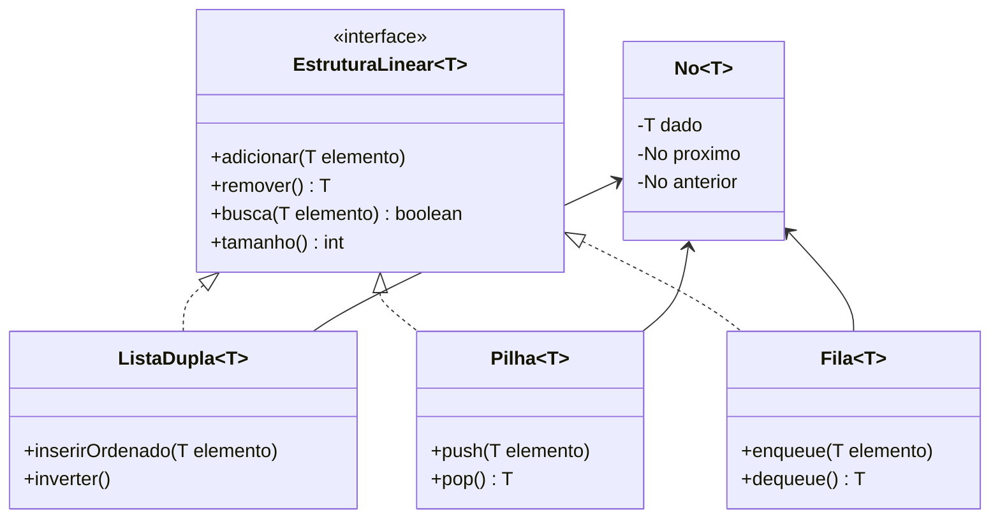

# Projeto StructureJava: Biblioteca de Estruturas de Dados

Este repositório contém a implementação da biblioteca `StructureJava`, desenvolvida como requisito final para a disciplina de **Estrutura de Dados I** do curso de Análise e Desenvolvimento de Sistemas da UNIUBE.

## 🎯 Objetivo
Desenvolver uma biblioteca Java (JAR) independente para manipulação de estruturas de dados lineares e hierárquicas, abstendo-se do uso de classes nativas do pacote `java.util` (como `ArrayList` ou `LinkedList`). O foco é o gerenciamento direto de ponteiros (nós) e alocação dinâmica de memória.

## 🛠 Estruturas Implementadas
- **Listas Dinâmicas**: Implementação de Listas Simples e Duplamente Encadeadas com operações de inversão e inserção ordenada.
- **Pilha (LIFO)**: Estrutura baseada em alocação dinâmica com operações de `push` e `pop`.
- **Fila (FIFO)**: Estrutura baseada em alocação dinâmica com operações de `enqueue` e `dequeue`.
- **Árvore Binária de Busca (BST)**: Estrutura hierárquica com métodos de inserção recursiva e busca eficiente O(log n).

## 🚀 Tecnologias e Ferramentas
- **Linguagem**: Java (Genérico `<T>`)
- **IDE**: IntelliJ IDEA
- **Gerenciamento**: SDK Java 21+

## 📁 Estrutura do Projeto

Abaixo está a organização dos arquivos fonte (`/src`) e suas respectivas finalidades:

- `ArvoreBinaria.java`: Implementação de BST com busca recursiva.
- `EstruturaLinear.java`: Interface contratual para padronização das operações.
- `Fila.java`: Implementação da estrutura FIFO (First-In, First-Out).
- `ListaDupla.java`: Lista duplamente encadeada com suporte a inversão e inserção ordenada.
- `Main.java`: Ponto de entrada do sistema para testes e demonstração.
- `No.java`: Classe base para encapsulamento de dados e referências de memória.
- `NoArvore.java`: Nó especializado para estruturas hierárquicas.
- `Pilha.java`: Implementação da estrutura LIFO (Last-In, First-Out).

## ⚙️ Como Executar
1. Certifique-se de ter o **JDK 17 ou superior** instalado.
2. Clone este repositório em sua máquina.
3. Abra o projeto no IntelliJ IDEA.
4. Caso a pasta `src` não esteja azul, clique com o botão direito nela > **Mark Directory as** > **Sources Root**.
5. Execute o arquivo `Main.java` clicando no ícone de "Play" ao lado do método `main`.

## 🧪 Testes e Resultados
O arquivo `Main.java` realiza uma bateria de testes que imprime no console o estado das estruturas após cada manipulação.
- **Exemplo de saída de Árvore**: A visualização em 2D mostra a hierarquia (raiz, subárvores esquerda/direita), permitindo mapear o caminho percorrido durante a busca.
- **Exit Code 0**: A ausência de erros durante a execução dos testes de estresse (cargas massivas) garante a integridade da manipulação de ponteiros.

## ⚙️ Diagrama de Classes

    
## 👨‍💻 Autores
- **Carlos Junio Oliveira de Souza** (RA: 5170260)
- **Thiago Mendes** (RA: 5170162)

---
*Projeto desenvolvido para a disciplina de Estrutura de Dados I - UNIUBE (2026).*
